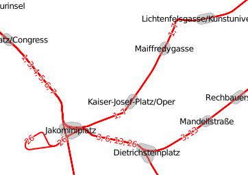

Example 1: Major roads and parks
================================
For starters a simple example will be shown: Major roads and parks.


```css
/* draw a green polygon for all parks */
area[leisure=park] {
  fill-color: #00af00;
}
/* print a label on all parks */
area[leisure=park]::label {
  text: eval(tag(name));
  font-family: "DejaVu Sans Oblique";
  font-size: 9;
  text-color: #005f00;
  z-index: 3;
}

/* all major roads will be rendered with a 2px black line */
line|z12-[highway=primary],
line|z12-[highway=secondary],
line|z12-[highway=tertiary] {
  color: #000000;
  width: 2;
  z-index: 1;
}
/* and a black label next to the line
   with a 50% transparent white halo */
line|z12-[highway=primary]::label,
line|z12-[highway=secondary]::label,
line|z12-[highway=tertiary]::label {
  text: eval(tag(name));
  text-offset: 9;
  text-color: #000000;
  text-halo-color: #ffffff7f;
  text-halo-radius: 1;
  line-position: line;
  z-index: 2;
}
```

Example 2: Layering roads
=========================
This example shows how eval-statements for z-index can be used to layer roads correctly.

Warning: This example needs Mapnik branch 'stroke-width-expr' or version 3.0 and accompaning modifications in file default-template.mapnik (search for 'stroke-width-expr' for details). If you run this example with Mapnik 2.2 the casing might be missing.


```css
line[highway=motorway],
line[highway=trunk] {
  width: 4;
  set .major_road;
}
line[highway=motorway_link],
line[highway=trunk_link] {
  width: 2;
  set .major_road;
}
line.major_road {
  linecap: round;
  color: #ff0000;
  z-index: eval(any(tag('layer'), 0)+0.5);
}

line.major_road::casing {
  linecap: butt;
  width: eval(prop(width, default)+2);
  color: #707070;
  z-index: eval(any(tag('layer'), 0));
}
line.major_road[bridge]::casing {
  color: #000000;
}
line.major_road[tunnel] {
  color: #ff7f7f;
}
line.major_road[tunnel]::casing {
  dashes: 3, 3;
}
```

Example 3: Place nodes and their population
===========================================
In the 3rd example we see the places names of some villages and a simple
diagram with the population size. Also the administrative boundaries are shown.


```css
/* Print the name of all places */
point[place] {
  text: eval(tag(name));
  z-index: 2;
}

/* For each place show a diagram: a red circle depending on the
  population of the place. We are using the square root of population
  as pixel radius to not grow too fast. */
point[place]::diagram {
  geo: eval(buffer(prop(geo), sqrt(tag(population))));
  fill-color: #ff7f7f;
  color: #ff0000;
  width: 1;
}

/* Also, show administrative boundaries as purple lines */
line[boundary=administrative][admin_level<=8],
relation[boundary=administrative][admin_level<=8] {
  color: #7f00ff;
  width: 1;
  z-index: 1;
}
```

Example 4: Tramway network
==========================
A route map of all tramway routes (and other means of transportation, but this should just be a simple example) should show all routes on their ways nicely sorted. This is something that usually needs quite some database magic, but can be achieved with some simple statements in pgmapcss.


```css
/* Draw all tram routes in red */
line[route=tram] {
  color: #ff0000;
  width: 2;
}

/* For every route iterate over all members to save their 'ref' tag
   to the child tag 'ref_list' */
relation[route=tram] > line|z14-[railway] {
  set ref_list = eval(push(tag(ref_list), parent_tag(ref)));
}

/* Remove duplicate refs from list, sort the list 'naturally' and join
   the elements by ', '. Print the ref tags in red with a white halo. */
line|z14-[railway]::label {
  text: eval(join(natsort(unique(tag(ref_list))), ", "));
  text-color: #ff0000;
  text-halo-color: #ffffff;
  text-halo-radius: 1;
  text-position: line;
  z-index: 1;
}

```

Data: (c) [[http://www.openstreetmap.org|OpenStreetMap]] contributors.
